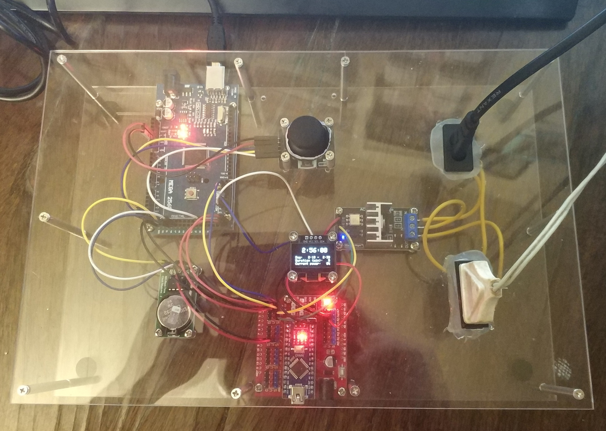

# Daily lamp control

These sketches are to be uploaded into a contraption built with two Arduino boards (master and slave).
Once you constructed it and uploaded sketches, it will control you lamp every day based on specific daytime.
Say, you set day to begin at 7:00 and end at 22:00, and morning/evening duration to 60 min.
Then, this thing will lamp at 0% power till 7:00, then during 60 minutes (up to 8:00) it will slowly raise lamp power up to 100%.
When day is over at 22:00, it will slowly lower lamp power for another 60 minutes, until it reaches 0% again at 23:00.

## Bill of materials

* Arduino Mega 2560.
* Arduino Nano.
* Arduino Nano carrier board, like [this](https://www.jsumo.com/arduino-nano-carrier-board).
* RTC board based on DS1302, like [this](https://electropeak.com/learn/interfacing-ds1302-real-time-clock-rtc-module-with-arduino/).
* Adafruit SSD1306 [128x64](https://lastminuteengineers.com/oled-display-arduino-tutorial/) or [128x32](https://www.adafruit.com/product/931) I2C OLED display.
* Analog joystick, like [this](https://exploreembedded.com/wiki/Analog_JoyStick_with_Arduino).
* [RobotDyn Dimmer](https://robotdyn.com/catalog/ac-dimmers.html), I used the 4A/8A model.
* CR2032 battery.

## Connections

Install CR2032 battery into the RTC board.

Install Nano board into the carrier.

Connect dimmer terminals to input and output 110/220V sockets.
Input socket shall be connected to wall outlet, and output one could be used to connect the lamp to be controlled.
Be sure you connect the lamp that is dimmable!
Incandescent bulbs are perfect, although there are few cold cathode or LED lamps that support this too. Check notes on lamp'sd package prior to buying it.

Connect at least one pair of 5V and GND pins on Arduino Mega to corresponding pins on Nano carrier.
You may connect not a single pair, but two or three 5V/GND pairs to reduce voltage drop between Mega and Nano.

For DS1302 board, display, joystick, and dimmer, connect VCC and GND to corresponding pins on Nano carrier or Mega.

### Signal connections

* DS1302: CLK = Mega pin 47, DAT = Mega pin 49, RST = Mega pin 51.
* Joystick: VRX = Mega pin A15, VRY = Mega pin A14, SW = Mega pin 30.
* Display: SCL = Mega pin 21, SDA = Mega pin 20.
* Dimmer: Z-C = Nano pin 2, PSM = Nano pin 3.
* Nano pin 0 = Mega pin 16, Nano pin 1 = Mega pin 17.

The last connection is required for data exchange (TTL UART) between Mega nad Nano.

## Building

Install required libraries into your Arduino IDE: DS1302, Adafruit_SSD1306, and [RBDDimmer](https://github.com/RobotDynOfficial/RBDDimmer).

Configure `master.ino` for the type of display you use.
If you use 128x64, do nothing; otherwise, if you use 128x32, change the line `#define SSD1306_128x64` to `#define SSD1306_128x32`.

Build `master.ino` and upload it to Mega.

Build `slave.ino` and upload it to Nano.

## Control

Use joystick to set up the values.
Single press lets you enter the setup mode.
In this mode you can move joystick left or right to select a value to modify, and up or down to adjust it.
When you're done, press joystick again to activate new values (and save them to EEPROM).

